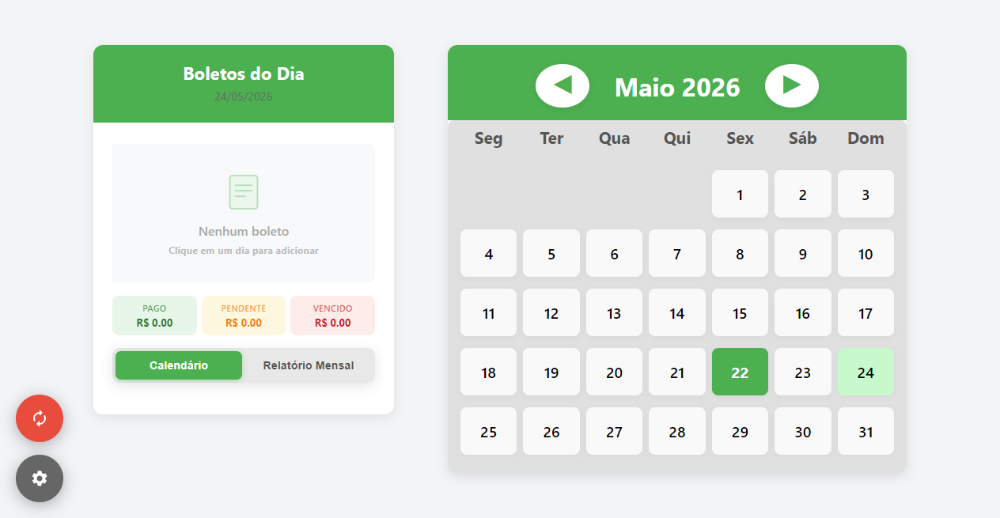
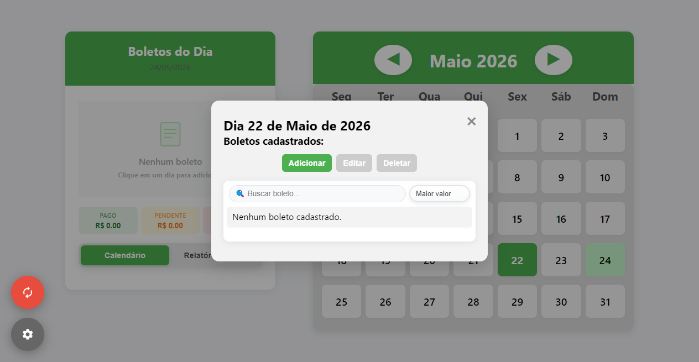
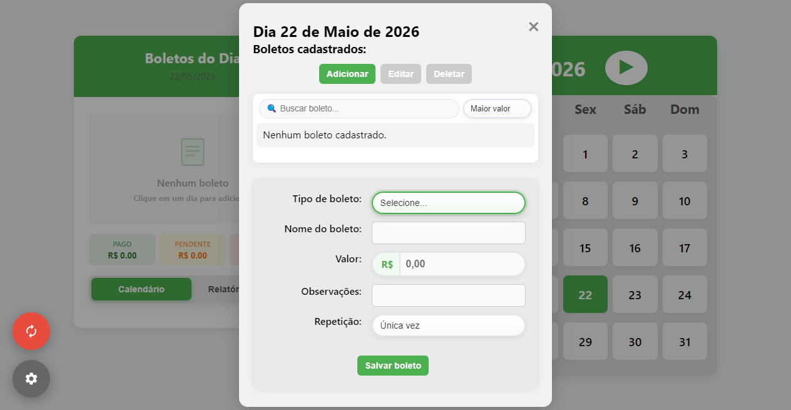
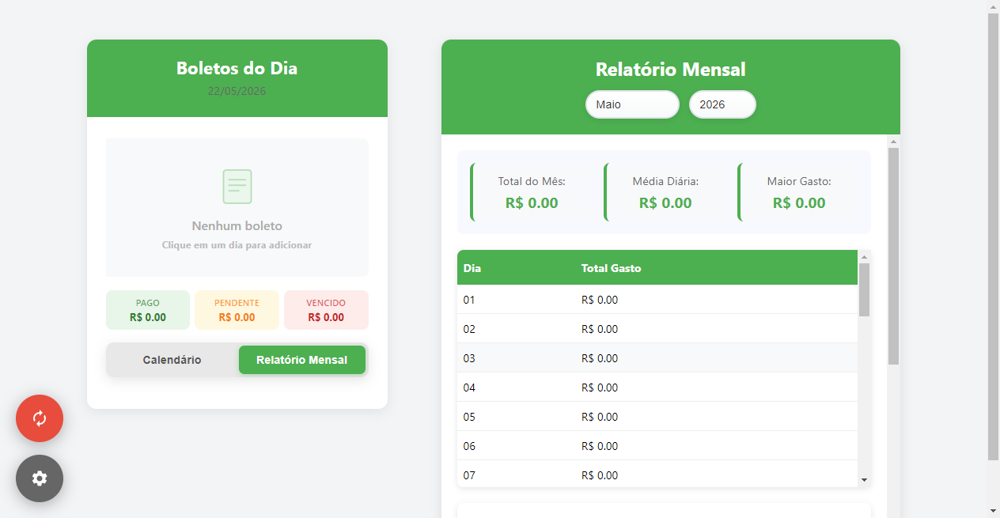
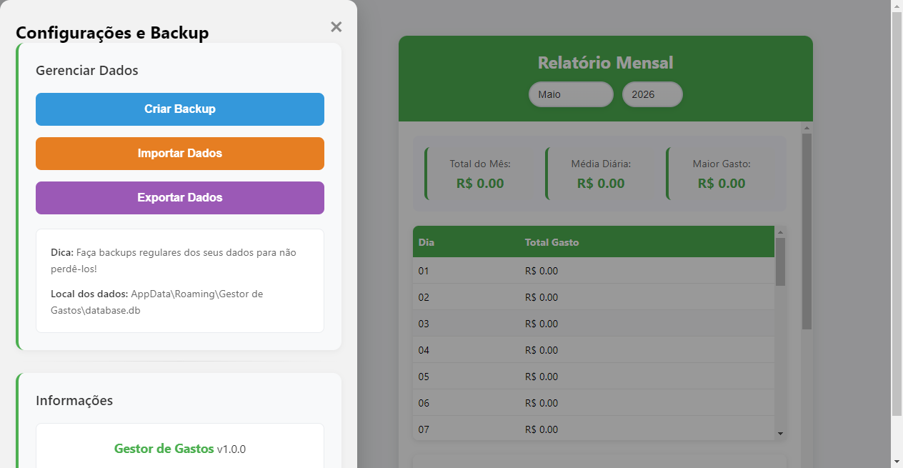

<div align="center">

# Gestor de Gastos Desktop

**Controle financeiro pessoal com calendário interativo, relatórios e backup automático.**

[](https://www.electronjs.org/)
[](https://developer.mozilla.org/en-US/docs/Web/JavaScript)
[](https://sqlite.org/)
[](https://www.chartjs.org/)
[](https://www.microsoft.com/windows)

> Um aplicativo desktop para quem quer ter controle real dos boletos e gastos do mês. Calendário visual, relatórios com gráfico e backup local — tudo sem depender de internet.



</div>

<br>

## O que o app faz

### 📅 Calendário Interativo
- Visualização mensal com destaque nos dias que têm boletos cadastrados
- Navegação por mês com setas
- Clique em qualquer dia para adicionar ou visualizar lançamentos

### 📊 Relatório Mensal
- Tabela com gastos diários do período selecionado
- Resumo com total do mês, média diária e maior gasto
- Gráfico de pizza com a distribuição por categoria
- Filtro por mês e ano para consultar o histórico

### 🧾 Gestão de Boletos
- Categorias: Água, Luz, Internet, Telefone, Aluguel, Cartão, Imposto, Contadora, Outros
- Repetição mensal automática para boletos fixos
- Campo de observações e alertas por lançamento

### 💾 Backup e Segurança
- Backup manual com um clique
- Importação de backups anteriores
- Banco de dados criado automaticamente em `%APPDATA%/Gestor de Gastos/database.db`

<br>

## Como rodar

Você precisa ter o **Node.js 18 ou superior** instalado.

```bash
git clone https://github.com/NicolasCardoso2/gestor-gastos-desktop.git
cd gestor-gastos-desktop
npm install
npm start
```

| Script | O que faz |
|---|---|
| `npm start` | Abre o app em modo desenvolvimento |
| `npm run dist` | Gera o instalador `.exe` na pasta `dist/` |
| `npm run clean` | Remove arquivos temporários |

<br>

## Estrutura do projeto

```
gestor-gastos/
├── assets/          # Ícones e recursos
├── renderer/        # Interface (HTML, CSS e JS)
│   ├── index.html
│   ├── renderer.js
│   └── styles.css
├── main.js          # Processo principal do Electron
├── preload.js       # Ponte segura entre main e renderer
└── package.json
```

<br>

## Screenshots

<div align="center">


*Calendário principal com destaque nos dias que têm boletos cadastrados*

<br>


*Lista de boletos do dia selecionado*

<br>


*Formulário de cadastro com campo de valor formatado em R$*

<br>


*Relatório mensal com resumo financeiro e gráfico por categoria*

<br>


*Configurações de backup e importação de dados*

</div>

<br>

## Tecnologias usadas

| Tecnologia | Função |
|---|---|
| **Electron 31** | Framework para apps desktop com JS |
| **SQLite** | Banco de dados local, sem precisar de servidor |
| **Chart.js** | Gráficos do relatório mensal |
| **Node.js 18** | Runtime JavaScript |
| **HTML, CSS e JS** | Interface do usuário (ES6+) |

<br>

<div align="center">

Feito por [Nicolas Cardoso](https://github.com/NicolasCardoso2) · [LinkedIn](https://www.linkedin.com/in/nicolas-cardoso-vilha-do-lago-2483b1322/)

</div>

